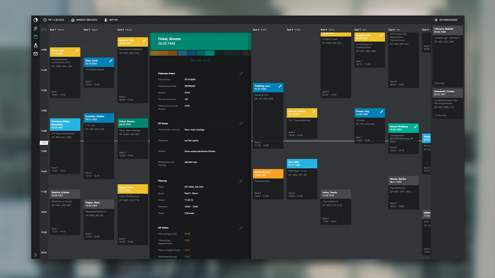
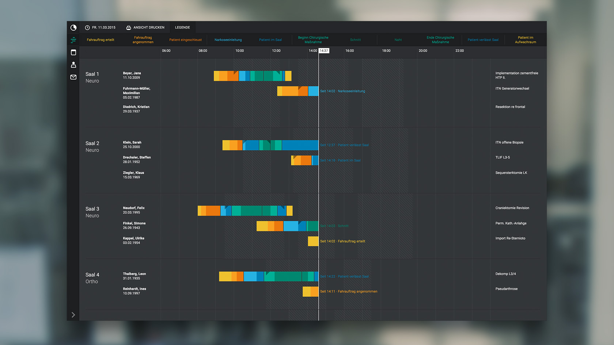

# OPMS – Surgery-Management-System

**OPMS is an interface for managing a hospital’s surgery department. It is built around the needs of the users, that we interviewed prior to it’s design and development.**

We only show the data that is necessary but always keep all data in reach in case it is needed. The user is guided and supported but not constrained or patronized. The interface is designed to be easy on the eyes and very clear about timeframes, states and the relationship between different parts of data.

**Find out more: [www.christophlabacher.com/opms](http://www.christophlabacher.com/opms)**

## Prototype

In this repository you can find a high-fidelity prototype built in HTML, CSS and JavaScript. We built it in order to be able to test the interface and present it in a way so that people could actually explore how the information is shown.

**The can be downloaded and run as a stand-alone app for OS X: [Download “OPMS – Surgery-Management-System.app”](https://github.com/ChristophLabacher/OPMS-Surgery-Management-System/releases/download/0.1.0/OPMS-Surgery-Management-System.app.zip).**

## Meta
OPMS was developed as a student project during summer semester 2014 by [Anna Foltinek](http://anna-foltinek.de) and [Christoph Labacher](http://christophlabacher.com) as part of a course in Interface Design by Thomas Techert.
